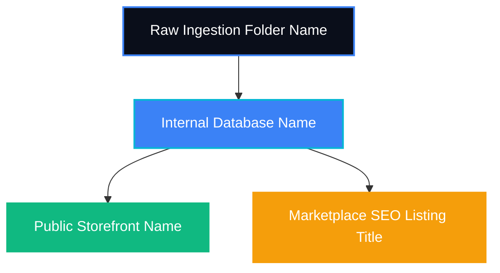

# BRAND_BOOK.md — Digital Product Studio Brand Manual

This is the official brand manual for **Digital Product Studio**. It governs the brand identity, content generation standards, asset naming conventions, and e-commerce listing guidelines across all platforms.

---

## 1. Digital Product Studio

**Digital Product Studio** (DPS) is a next-generation semi-automated digital product publishing studio. We bridge the gap between creative execution and high-scale automated marketplace delivery, enabling solo operators to build, QA, and distribute digital products (PDF planners, Canva templates, Excel spreadsheets, AI prompt kits) to Etsy, Gumroad, Lemon Squeezy, Shopify, WooCommerce, and more.

Our brand represents **precision, scalability, simplicity, and efficiency**.

---

## 2. Mission

To empower creators and solo operators to design, enrich, and publish high-quality, high-value digital products at scale through intelligent automation and human curation—eliminating manual friction and unlocking passive income potential.

---

## 3. Vision

To become the world's leading engine for digital product generation, indexing, and multi-channel publishing, helping developers and content creators build asset catalogs of 100,000+ listings with near-zero manual effort.

---

## 4. Tagline

> **"Create Once. Publish Everywhere. Scale Infinitely."**

---

## 5. Brand Voice

The Digital Product Studio voice is:
*   **Efficient & Precise**: We avoid fluff. We speak in clear, structured, actionable sentences.
*   **Empowering & Creator-Centric**: We speak directly to operators and creators, highlighting how technology simplifies their workflow.
*   **Systematic & Authoritative**: We treat digital product publishing as an engineered pipeline. We use words like *swarms*, *pipelines*, *nodes*, *catalogs*, and *ingestion*.
*   **Accessible but Technical**: We are developer-friendly but fully accessible to non-technical operators.

---

## 6. Typography

Typography should always be clean, modern, and highly readable, reflecting our tech-forward and structured identity.

*   **Primary Font (Body Text)**: **Inter** (Google Fonts)
    *   *Usage*: All system text, user interfaces, documentation, and standard emails.
    *   *Weights*: Regular (400) for body, Medium (500) for controls/labels, Semi-Bold (600) for subheaders.
*   **Display Font (Headings)**: **Outfit** (Google Fonts)
    *   *Usage*: Logo wordmarks, page headings (`h1`, `h2`), and marketing landing pages.
    *   *Weights*: Bold (700) or Extra-Bold (800).
*   **Monospace Font (Code & Metadata)**: **Fira Code** or **SF Mono**
    *   *Usage*: SKU listings, file paths, database entries, and code snippets in documentation.

---

## 7. Color Palette

Our colors reflect a premium, state-of-the-art dark mode design system. We use sleek, modern HSL values that feel energetic yet professional.

| Color Role | Hex Value | HSL Value | Description / Usage |
| :--- | :--- | :--- | :--- |
| **Deep Space (Background)** | `#0A0E1A` | `hsl(225, 45%, 7%)` | Primary canvas background; provides high contrast for typography. |
| **Slate Grey (Text/Neutral)** | `#94A3B8` | `hsl(215, 25%, 62%)` | Main body text and secondary labels. |
| **Electric Blue (Primary Accent)** | `#3B82F6` | `hsl(217, 91%, 60%)` | Key interactive actions, focus states, and primary brand buttons. |
| **Glowing Cyan (Secondary Accent)** | `#06B6D4` | `hsl(189, 94%, 43%)` | Tooltips, highlights, and status tags for in-progress operations. |
| **Neon Green (Success/Active)**| `#10B981` | `hsl(162, 76%, 41%)` | "Published" status, successful checkmarks, and positive metrics. |
| **Amber Warning (Caution)** | `#F59E0B` | `hsl(38, 92%, 50%)` | "Pending Approval" status, confirmation dialog warnings. |
| **Crimson Red (Danger/Error)** | `#EF4444` | `hsl(0, 84%, 60%)` | Ingestion errors, duplicate detection alerts, and system warnings. |

---

## 8. Logo Usage

The Digital Product Studio logo consists of the **Swarm Node Glyph** and the **Digital Product Studio Wordmark**.

```
    [ / \ ]       DIGITAL
   [ \ / \ ]      PRODUCT
    [ \ / ]       STUDIO
```

### Visual Guidelines:
1.  **Clear Space**: Ensure a minimum clearance margin around the logo equal to 50% of the logo's width.
2.  **Color Contexts**:
    *   *On Dark Backgrounds*: Use the Electric Blue and Glowing Cyan glyph with an Outfit Semi-Bold white wordmark.
    *   *On Light Backgrounds*: Use a Deep Navy wordmark.
    *   *Monochrome*: Use solid white or solid black depending on background contrast.
3.  **Prohibited Uses**:
    *   Do not stretch, rotate, or compress the logo.
    *   Do not add drop shadows or gradients outside of the official brand color definitions.
    *   Do not use the logo wordmark alone without the Outfit font formatting.

---

## 9. Do's and Don'ts

### Do's
*   **DO** review all AI-generated listings through the operator approval gate before publishing.
*   **DO** run the SHA-256 duplicate detection check on all raw ingest files to protect marketplace health.
*   **DO** use strict SKU structures in the metadata of every digital asset.
*   **DO** optimize all filenames for both human readability and automated scripts.

### Don'ts
*   **DON'T** publish raw, unedited AI output directly to marketplaces without operator QA.
*   **DON'T** use generic filenames (e.g., `final_draft.pdf` or `Untitled_Planner.xlsx`) for customer downloads.
*   **DON'T** modify the SQLite database schemas without updating `LifecycleManager` mappings.
*   **DON'T** use spaces or special characters in folder names under `catalog/active/`.

---

## 10. SEO Naming

To maximize organic search performance across marketplaces, all product titles and descriptions must follow standard SEO schemas.

### Product Title Schema (Marketplace Optimized)
Titles must be keyword-rich, clear, and comply with the strict **140-character limit** (Etsy maximum).

*   **Format**: `[Core Product Name] - [Primary Benefit/Format] | [Target Audience/Use Case] | [Secondary Keywords]`
*   *Example*: `Sleek Financial Ledger - Monthly Excel Budget Spreadsheet | Personal Wealth Planner, Debt Snowball Tracker, Automated Finance Template`

### Meta Description Schema
Meta descriptions should be engaging, informative, and include a call to action.

*   **Format**: `Simplify your [process] with our [product name]. Designed for [target audience], this [format] features [feature 1] and [feature 2]. Download instantly now!`
*   *Example*: `Simplify your monthly budgeting with our Sleek Financial Ledger. Designed for busy professionals, this Excel template features automated dashboards and debt snowball tracking. Download instantly now!`

### Product Tagging Rules
*   Every product must contain exactly **13 tags** (Etsy compliance).
*   Each tag must be under **20 characters** (spaces allowed, no special punctuation).
*   Tags should include 4 Core Category tags, 5 Benefit/Feature tags, and 4 Long-tail search query tags.

---

## 11. Email Signature

All external correspondence from the studio must use the standardized email signature to maintain operational consistency.

```
--
[Operator/Director Name]
Operations & Swarm Director | Digital Product Studio
Email: hello@digitalproductstudio.in
Web: https://digitalproductstudio.in

CONFIDENTIALITY NOTICE: This email and any attachments are confidential and intended solely for the use of the individual or entity to whom they are addressed. If you have received this email in error, please notify the sender immediately and delete it from your system.
```

---

## 12. Social Handles

Use the following naming patterns across all social media and marketplace platforms:

*   **GitHub**: `gitsaransh/DigitalProductStudio`
*   **LinkedIn**: `linkedin.com/company/digitalproductstudio`
*   **Twitter/X**: `@digitalprodstudio`
*   **Instagram**: `@digitalproductstudio`
*   **Pinterest / Etsy Shop**: `DigitalProductStudioCo`

---

## 13. File Naming Standards

All workspace assets must adhere to strict casing and structure rules to ensure automation scripts do not break.

### Ingestion Folders (raw_ingest)
Before processing, raw assets folders must use lowercase snake-case with dates and categories:
*   **Format**: `YYYY-MM-DD_[category]_[product-name-slug]`
*   *Example*: `2026-08-16_planner_minimalist-daily-tracker`

### Active Catalog Folders (active)
Post-ingestion, catalog directories are organized under the clean SKU:
*   **Format**: `catalog/active/[sku]/`
*   *Example*: `catalog/active/PLN-001/`

### Customer-Facing Deliverables
The downloadable files delivered to customers must be professional and standardized.
*   **Format**: `DPS_[SKU]_[Product-Name-CamelCase]_[Version].[extension]`
*   *Example*: `DPS_PLN-042_MinimalistDailyPlanner_v1.0.pdf`

---

## 14. SKU Standards

Stock Keeping Units (SKUs) are the source of truth tracking identifier for the studio. They link local catalog databases, Git commits, and e-commerce listings.

### SKU Structure
`[CAT]-[NUM]`
*   `CAT`: A 3-letter uppercase category prefix.
*   `NUM`: A 3-digit sequential number starting at `001`.

### Category Codes

| Category Code | Digital Product Type | Target Formats |
| :--- | :--- | :--- |
| **`PLN`** | Planners & Organizers | Interactive PDF, GoodNotes |
| **`CNV`** | Canva Design Templates | Shared Canva URL |
| **`XLS`** | Spreadsheets & Trackers | Microsoft Excel, Google Sheets |
| **`PRM`** | AI Prompt Kits | Markdown, Text Files |
| **`PRD`** | Development Boilerplates | ZIP code repositories, Git repo |

*Example SKU*: `XLS-008` (referencing the 8th spreadsheet product).

---

## 15. Product Naming Convention

We maintain a strict difference between **internal filenames**, **catalog titles**, and **public storefront names**.



### 1. Raw Ingestion Folder Name
*   *Purpose*: Automated watchers.
*   *Style*: lowercase snake-case with date prefix.
*   *Example*: `2026-08-16_xls_monthly-budget-ledger`

### 2. Internal Database Name
*   *Purpose*: Python lifecycle, SQLite indexing, and Git commits.
*   *Style*: Sentence Case with version suffix.
*   *Example*: `Monthly Budget Ledger v1.0`

### 3. Public Storefront Name
*   *Purpose*: High-converting, clean visual design on our custom store.
*   *Style*: Short, elegant title in Title Case.
*   *Example*: `Sleek Monthly Budget Ledger`

### 4. Marketplace SEO Listing Title
*   *Purpose*: Algorithm discovery on Etsy/Amazon.
*   *Style*: Keyword-dense title with punctuation pipes (140-char limit).
*   *Example*: `Sleek Monthly Budget Ledger (Excel) | Automated Budgeting Template & Debt Tracker`
