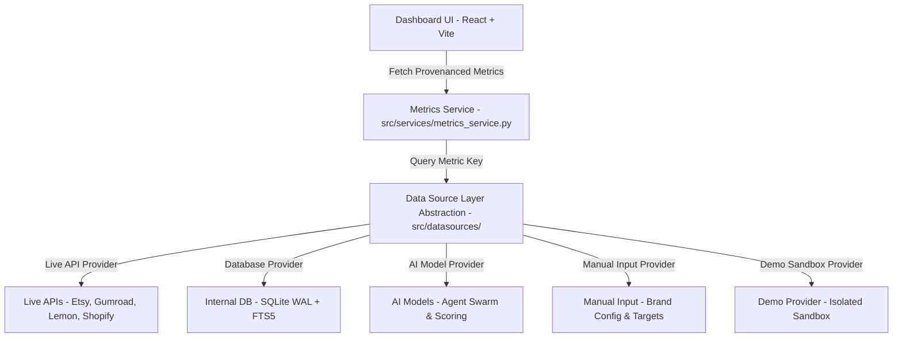
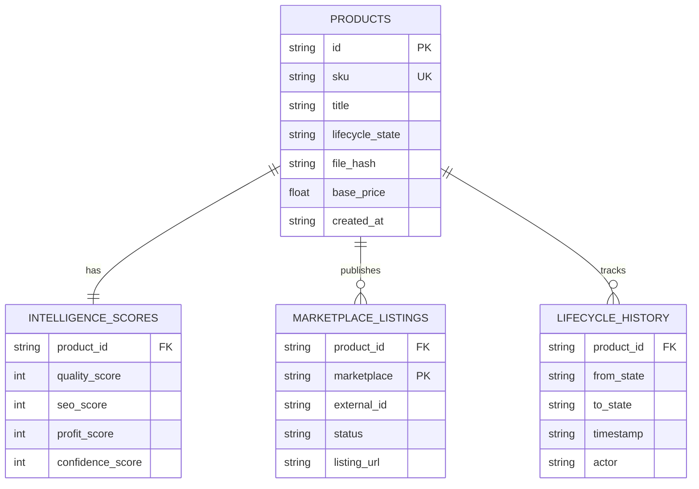

# Technical Design Document (TDD) - Phase 2 Enterprise Architecture

## 1. Enterprise System Architecture & Data Source Layer

## 2. Decoupled Metrics Pipeline & Provenance Attribution

Every metric returned by `MetricsService` incorporates a mandatory `data_source` tag and provenance structure:
- **`LIVE_API`**: Real-time connected platform metrics (Etsy API v3, Gumroad API v2).
- **`INTERNAL_DB`**: Metrics computed directly from local SQLite WAL catalog records.
- **`AI_MODEL` / `ESTIMATED`**: Scores generated algorithmically by the AI Agent Swarm.
- **`MANUAL_INPUT`**: Values defined directly by user configuration.
- **`NOT_CONNECTED`**: Clean real-world state when an external API or sales channel is unlinked.

## 3. Entity-Relationship (ER) Diagram

